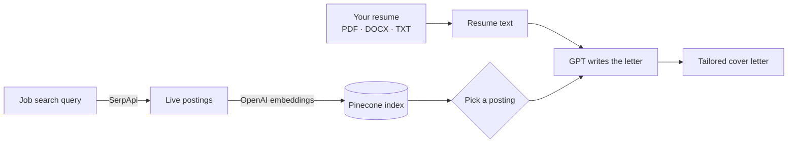

<p align="center">
  
</p>

<p align="center">
  
  
  
  
  
</p>

Writing a good cover letter for every application takes an hour you don't have. This Streamlit app
finds real job postings, reads your resume, and drafts a cover letter written for the posting you
pick, not a generic template. It has been used by 300+ people.

Built by Team Symphony for a generative AI course at Santa Clara University.

## How it works



1. **Search:** pulls live postings for any query ("Data Analyst in San Jose") through SerpApi.
2. **Embed:** stores each posting as an OpenAI embedding in a Pinecone index so they can be searched and matched.
3. **Read:** extracts the text of your resume, whether it's a PDF, a Word file, or plain text.
4. **Write:** GPT combines the posting and your resume into a letter that points to your actual experience.

## Run it

```bash
python -m venv venv
venv\Scripts\activate          # macOS/Linux: source venv/bin/activate
pip install -r requirements.txt
streamlit run app/app.py
```

Enter your own SerpApi, OpenAI, and Pinecone keys in the sidebar. They're kept only for your session
and never written to disk. To create the Pinecone index ahead of time, run
`python scripts/setup_pinecone.py` with `PINECONE_API_KEY` and `PINECONE_ENVIRONMENT` set.

## Repository layout

```
app/app.py                     Streamlit app
scripts/setup_pinecone.py      Creates the Pinecone index
scripts/setup_job_postings.py  Fetches and loads postings in bulk
requirements.txt
```
